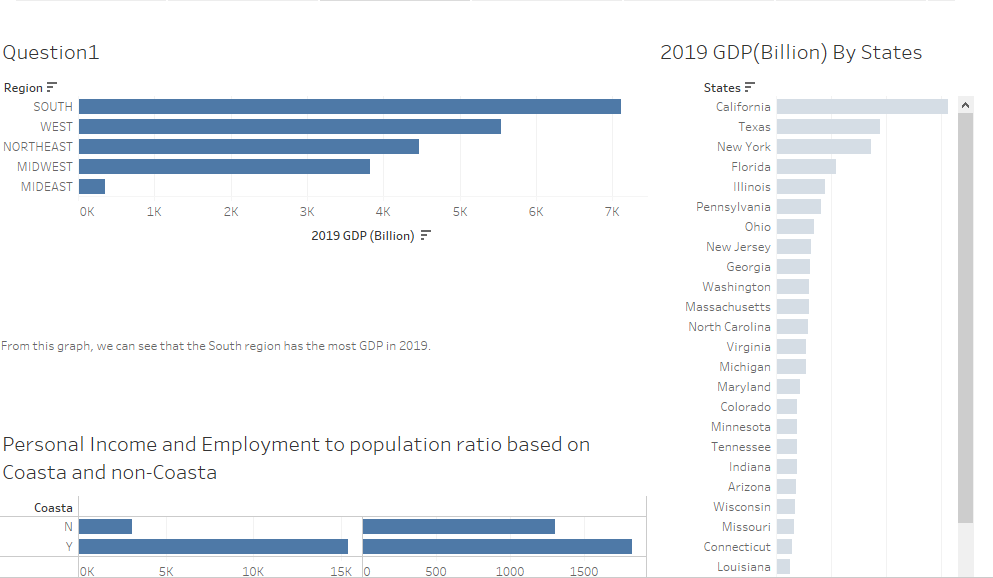
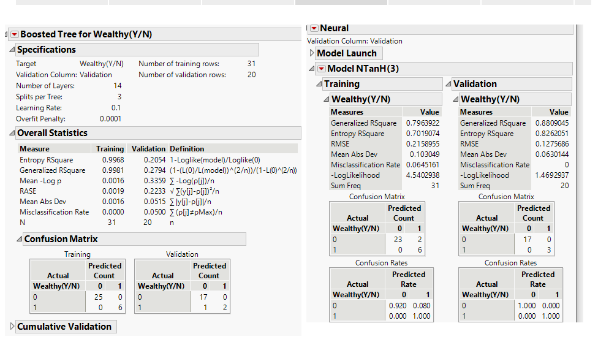
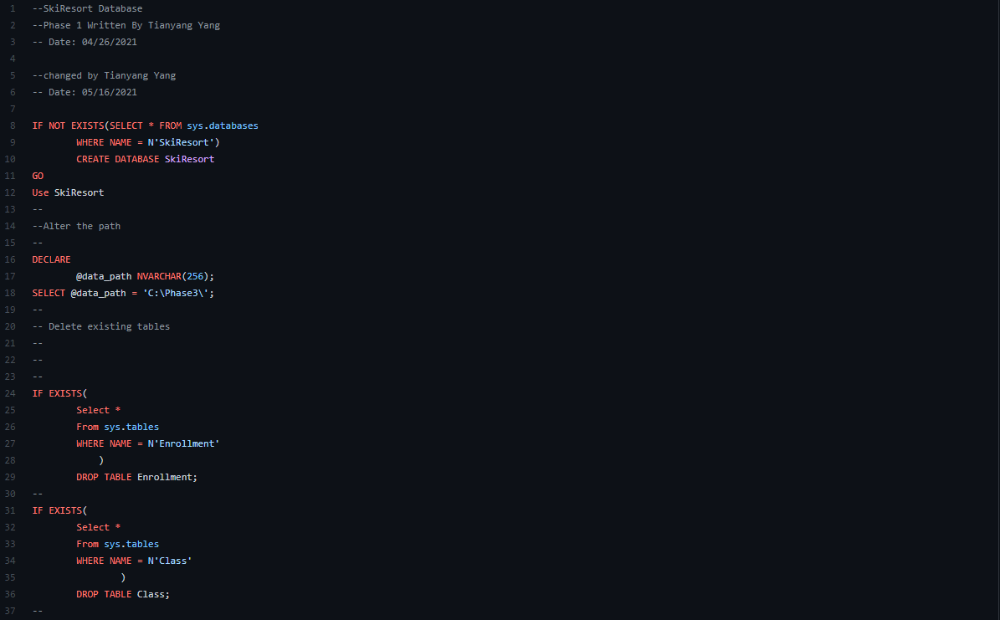
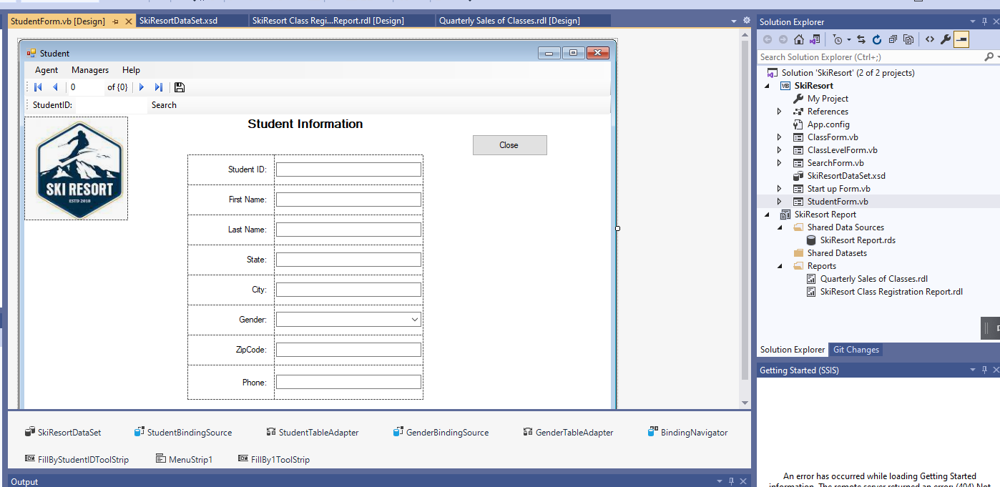
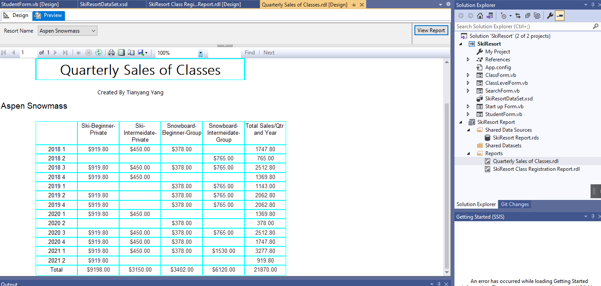

# About Me
- 👋 Hi, I’m @Tianyang Yang. I am an international student from Chengdu China.
- 📫 Now I am a Business Analytics major senior student of University of Denver.
- 👀 I’m interested in Learning business analytics, playing video games like League of Legend.Also I like watching animes.
- 🌱 I’m currently learning Data Warehousing and Project Management.
- 📫 How to reach me Tianyang.Yang@du.edu.

<!---
Tianyang/Tianyang is a ✨ special ✨ repository because its `README.md` (this file) appears on your GitHub profile.
You can click the Preview link to take a look at your changes.
--->

# Classes Taken
- Automating Business processes
- Found of information management
- Enterprise information management
- Data mining and visualization
- Project Management
- Data Ware and Bus Intell

# Career Aspiration
-Data Analyst

-Business Analyst

# Softwares and programming language
Visio Studio   /   Excel     /  Tableau     /  JMP      /   SQL Server    /   Python /   VBA 

# My Projects

 -Tableau and JMP project about 2019 State's GDP

For this project, by using Tableau and JMP skills, my friend Yicheng and I made charts and tables to analyze the performance of each predicting model in forecasting the State's GDP and Wealthy.

 -Database build Script and Visual Studio Forms and Report

For this project, I wrote build script code to build database for my project SkiResort which is the process of measuring the sales for the ski classes of the 3 resorts. And I built the forms and reports to see the quarerly sales and registration information of resorts in Visual Studio.
<!---
873400797/873400797 is a ✨ special ✨ repository because its `README.md` (this file) appears on your GitHub profile.
You can click the Preview link to take a look at your changes.
--->
